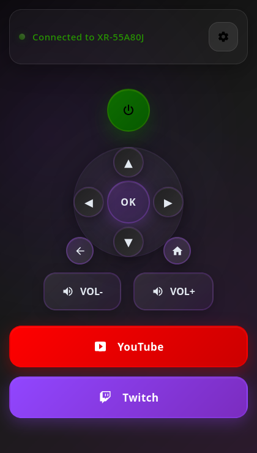
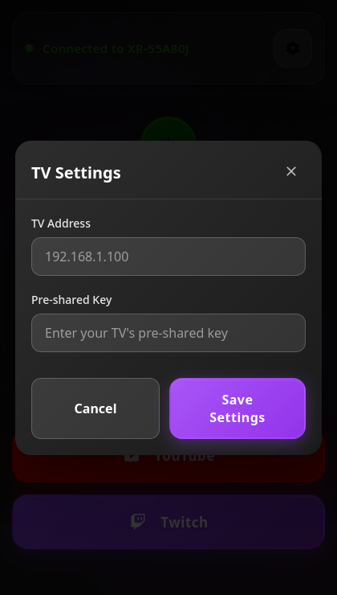
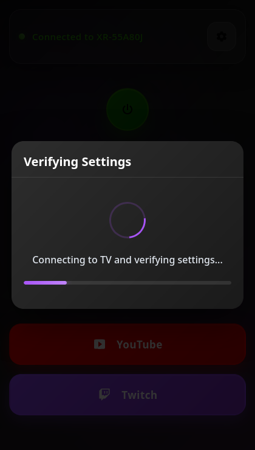

# Creamy TV Remote

This is an HTML file that uses the local Sony Bravia TV API.

## Preview

**Remote Control UI**

**Settings UI**

**Settings Verification UI**

## Configuring your TV

1. On your TV, open settings
2. Go to network, then home network, then IP control
3. Enable the pre-shared key option

## Configuring this file

1. Open this file
2. Enter the IP address of your TV
3. Enter the pre-shared key
4. Press "Save Settings"

## Troubleshooting

No support is offered, please check your developer console.
